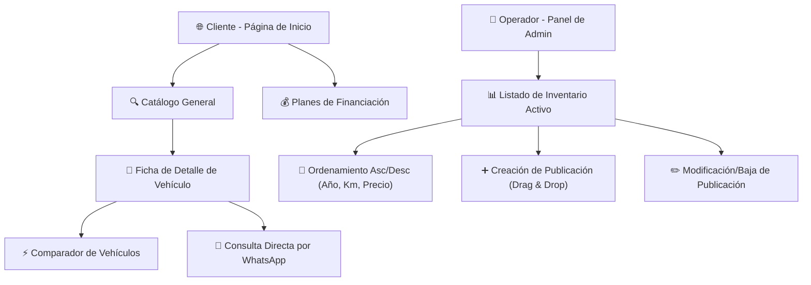

# 🚗 Plataforma Web de Concesionaria LUXEMOTORS

Esta presentación detalla la experiencia del usuario y las funcionalidades clave de la plataforma web de la concesionaria, incluyendo la navegación del cliente, la búsqueda filtrada y la carga de inventario desde el panel de administración.

---

## 📽️ Video Demostrativo del Funcionamiento Completo

A continuación puedes ver un recorrido continuo que muestra el flujo completo: desde la llegada de un cliente al inicio, la navegación por el catálogo interactivo con filtros, la consulta de detalles de un auto y, finalmente, el acceso al panel de administración para agregar y editar un vehículo.

---

## 📂 Arquitectura de Navegación

---

## 📂 Secciones de la Plataforma

### 1. Página de Inicio (Landing Page)
La pantalla de bienvenida presenta la identidad de la concesionaria con un diseño limpio, moderno y orientado a la conversión.

> [!NOTE]
> **Detalles de la Sección:**
> * **Hero Section:** Banner principal con eslogan de marca llamativo y botón de acción directa.
> * **Nuestros Autos (Destacados):** Galería con carrusel deslizable infinito en celulares y grilla responsive en computadoras.
> * **Planes de Financiación:** Tarjetas reorganizadas verticalmente en celulares (`h-[72px]`) para encajar en una sola pantalla.

---

### 2. Catálogo e Interacción con Filtros
La sección de catálogo permite a los usuarios buscar eficientemente entre los vehículos disponibles.

> [!TIP]
> **Filtros Avanzados:**
> * **Barra de Búsqueda:** Búsqueda en tiempo real por texto (por ejemplo, "Volkswagen").
> * **Rango de Precios Desplazable:** Deslizador de precio máximo ajustado dinámicamente según el inventario.
> * **Filtros Colapsables en Mobile:** Menú de filtros tipo acordeón para no sobrecargar el espacio en pantallas pequeñas.

---

### 3. Ficha de Detalle del Vehículo
Al hacer clic en "Ver detalles" de cualquier vehículo en el catálogo, se abre una vista dedicada.

> [!IMPORTANT]
> **Características Destacadas:**
> * **Galería:** Visor de imágenes interactivo.
> * **Comparador Integrado:** Sugiere vehículos similares para contrastar especificaciones en una tarjeta compacta de doble columna.
> * **Contacto Rápido:** Enlace directo a Google Maps, correo electrónico y WhatsApp sin formularios de por medio en móvil.

---

### 4. Panel de Administración
El área de administración permite gestionar el catálogo en tiempo real.

| Característica | Detalle Técnico |
| :--- | :--- |
| **Acciones Rápidas** | Botones de edición y borrado apilados verticalmente a la izquierda para mayor comodidad. |
| **Ordenamiento de Lista** | Ordenación ascendente/descendente directa al pulsar Año, Kilómetros o Precio en la cabecera. |
| **Carga de Archivos** | Selector local y zona de **Drag & Drop** que genera vistas previas de imágenes en Base64. |
| **Botón FAB** | Botón flotante animado de creación de publicación abajo a la derecha de la pantalla. |

